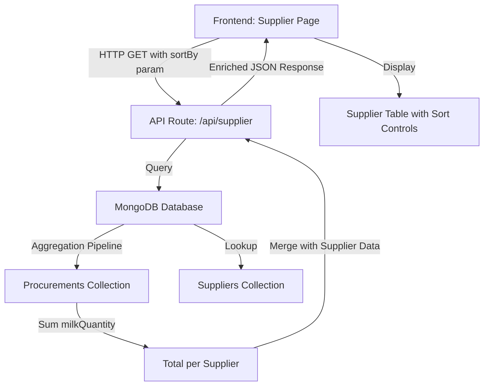

# Design Document: Supplier Sort by Milk Quantity

## Overview

This feature adds the capability to sort suppliers by their total milk quantity contribution across all procurement records. The implementation involves:

1. **Backend aggregation** using MongoDB aggregation pipeline to calculate total milk quantity per supplier
2. **API enhancement** to accept sorting parameters and return enriched supplier data
3. **Frontend UI updates** to display total milk quantity and provide sorting controls

The design leverages MongoDB's native aggregation capabilities for performance and maintains compatibility with existing search/filter functionality.

### Key Design Goals

- Calculate total milk quantity efficiently using database aggregation rather than client-side computation
- Preserve existing supplier management features (search, CRUD operations)
- Provide intuitive sorting UI that integrates seamlessly with current supplier table
- Ensure data accuracy by handling edge cases (no procurement records, null values)

## Architecture

### High-Level Architecture



### Data Flow

1. **User Action**: User selects sort option on frontend (e.g., "Total Milk Quantity ↓")
2. **API Request**: Frontend sends GET request to `/api/supplier?sortBy=totalMilkQuantity&sortOrder=desc`
3. **Aggregation**: Backend executes MongoDB aggregation pipeline:
   - Groups procurement records by `supplierId`
   - Sums `milkQuantity` for each supplier
   - Joins with suppliers collection
   - Sorts by total milk quantity
4. **Response**: API returns suppliers array with `totalMilkQuantity` field added
5. **Rendering**: Frontend displays sorted suppliers with total milk quantity column

## Components and Interfaces

### 1. Backend: MongoDB Aggregation Pipeline

**Purpose**: Calculate total milk quantity per supplier using database aggregation

**Aggregation Pipeline Stages**:

```javascript
// Stage 1: Group procurements by supplierId and sum milkQuantity
{
  $group: {
    _id: "$supplierId",
    totalMilkQuantity: { $sum: "$milkQuantity" }
  }
}

// Stage 2: Right outer join with suppliers collection
{
  $lookup: {
    from: "suppliers",
    localField: "_id",
    foreignField: "_id",
    as: "supplierData"
  }
}

// Stage 3: Unwind supplier data
{
  $unwind: {
    path: "$supplierData",
    preserveNullAndEmptyArrays: false
  }
}

// Stage 4: Merge fields and reshape document
{
  $replaceRoot: {
    newRoot: {
      $mergeObjects: [
        "$supplierData",
        { totalMilkQuantity: "$totalMilkQuantity" }
      ]
    }
  }
}

// Stage 5: Include suppliers with no procurements
// (Handled separately via union or fallback query)

// Stage 6: Sort by totalMilkQuantity
{
  $sort: { totalMilkQuantity: -1, createdAt: -1 }
}
```

**Handling Suppliers with No Procurements**:

Since suppliers may not have procurement records, we need two approaches:

- **Approach A (Union)**: Perform aggregation on procurements, then union with suppliers that have no matching procurements
- **Approach B (Left Join from Suppliers)**: Start from suppliers collection and left join with aggregated procurement totals

**Recommended Approach**: Approach B (Left Join from Suppliers)

```javascript
// Start from suppliers collection
{
  $lookup: {
    from: "procurements",
    let: { supplierId: "$_id" },
    pipeline: [
      { $match: { $expr: { $eq: ["$supplierId", "$$supplierId"] } } },
      { $group: { _id: null, total: { $sum: "$milkQuantity" } } }
    ],
    as: "procurementStats"
  }
}

// Add totalMilkQuantity field (default to 0)
{
  $addFields: {
    totalMilkQuantity: {
      $ifNull: [
        { $arrayElemAt: ["$procurementStats.total", 0] },
        0
      ]
    }
  }
}

// Remove temporary field
{
  $project: { procurementStats: 0 }
}

// Sort
{
  $sort: { totalMilkQuantity: -1, createdAt: -1 }
}
```

### 2. Backend: API Route Modifications

**File**: `src/app/api/supplier/route.js`

**Current Signature**:
```javascript
GET /api/supplier?supplierId=<id>&search=<term>
```

**Enhanced Signature**:
```javascript
GET /api/supplier?supplierId=<id>&search=<term>&sortBy=<field>&sortOrder=<asc|desc>
```

**New Query Parameters**:

| Parameter | Type | Required | Default | Description |
|-----------|------|----------|---------|-------------|
| `sortBy` | string | No | `createdAt` | Field to sort by: `createdAt`, `totalMilkQuantity` |
| `sortOrder` | string | No | `desc` | Sort direction: `asc`, `desc` |

**Response Schema**:

```typescript
// Existing supplier fields plus totalMilkQuantity
interface SupplierWithStats {
  _id: ObjectId;
  supplierName: string;
  supplierType: string;
  supplierTSRate: number;
  supplierCustomRate?: number;
  supplierNumber?: string;
  supplierAddress?: string;
  createdAt: Date;
  updatedAt: Date;
  totalMilkQuantity: number;  // NEW: Sum of all milk quantities
}

// Response body
type SupplierListResponse = SupplierWithStats[];
```

**Implementation Logic**:

```javascript
export async function GET(request) {
  const { searchParams } = new URL(request.url);
  const supplierId = searchParams.get("supplierId");
  const search = searchParams.get("search");
  const sortBy = searchParams.get("sortBy") || "createdAt";
  const sortOrder = searchParams.get("sortOrder") || "desc";
  
  // Validate sortBy
  const validSortFields = ["createdAt", "totalMilkQuantity"];
  if (!validSortFields.includes(sortBy)) {
    return NextResponse.json(
      { error: "Invalid sortBy parameter" },
      { status: 400 }
    );
  }
  
  // Validate sortOrder
  if (!["asc", "desc"].includes(sortOrder)) {
    return NextResponse.json(
      { error: "sortOrder must be 'asc' or 'desc'" },
      { status: 400 }
    );
  }
  
  const db = await getDatabase();
  
  // Handle single supplier fetch (unchanged)
  if (supplierId) {
    // ... existing single supplier logic
  }
  
  // Build aggregation pipeline for list fetch
  const pipeline = [];
  
  // Stage 1: Search filter (if provided)
  if (search && search.trim()) {
    pipeline.push({
      $match: {
        $or: [
          { supplierName: { $regex: search.trim(), $options: "i" } },
          { supplierType: { $regex: search.trim(), $options: "i" } },
          { supplierNumber: { $regex: search.trim(), $options: "i" } }
        ]
      }
    });
  }
  
  // Stage 2: Join with procurements and calculate total
  pipeline.push({
    $lookup: {
      from: "procurements",
      let: { supplierId: "$_id" },
      pipeline: [
        { $match: { $expr: { $eq: ["$supplierId", "$$supplierId"] } } },
        { $group: { _id: null, total: { $sum: "$milkQuantity" } } }
      ],
      as: "procurementStats"
    }
  });
  
  // Stage 3: Add totalMilkQuantity field
  pipeline.push({
    $addFields: {
      totalMilkQuantity: {
        $ifNull: [
          { $arrayElemAt: ["$procurementStats.total", 0] },
          0
        ]
      }
    }
  });
  
  // Stage 4: Remove temporary field
  pipeline.push({
    $project: { procurementStats: 0 }
  });
  
  // Stage 5: Sort
  const sortDirection = sortOrder === "asc" ? 1 : -1;
  const sortSpec = {};
  
  if (sortBy === "totalMilkQuantity") {
    sortSpec.totalMilkQuantity = sortDirection;
    sortSpec.createdAt = -1; // Secondary sort for ties
  } else {
    sortSpec.createdAt = sortDirection;
  }
  
  pipeline.push({ $sort: sortSpec });
  
  // Execute aggregation
  const suppliers = await db.collection("suppliers").aggregate(pipeline).toArray();
  
  return NextResponse.json(suppliers);
}
```

### 3. Frontend: UI Components

**File**: `src/app/supplier/page.jsx`

**Changes Required**:

1. **Add sort state management**
2. **Add sort controls to UI**
3. **Modify API fetch to include sort parameters**
4. **Add total milk quantity column to table**
5. **Update table to display total milk quantity**

**New State Variables**:

```javascript
const [sortBy, setSortBy] = useState("createdAt");
const [sortOrder, setSortOrder] = useState("desc");
```

**Modified fetchData Function**:

```javascript
const fetchData = useCallback(async () => {
  setLoading(true);
  try {
    const params = new URLSearchParams();
    if (sortBy) params.append("sortBy", sortBy);
    if (sortOrder) params.append("sortOrder", sortOrder);
    
    const res = await fetch(`/api/supplier?${params.toString()}`);
    if (!res.ok) {
      throw new Error(`Failed to fetch suppliers: HTTP ${res.status}`);
    }
    const data = await res.json();
    setEntries(Array.isArray(data) ? data : []);
  } catch (error) {
    console.error("Fetch error:", error);
    toast.error(error.message || "Failed to load suppliers");
    setEntries([]);
  } finally {
    setLoading(false);
  }
}, [sortBy, sortOrder]);

// Re-fetch when sort parameters change
useEffect(() => {
  fetchData();
}, [fetchData]);
```

**Sort Controls Component**:

```jsx
// Add this component near the search section
<div className={styles.sortSection}>
  <label htmlFor="sortSelect">Sort by:</label>
  <select
    id="sortSelect"
    value={sortBy}
    onChange={(e) => {
      setSortBy(e.target.value);
      // Default to desc for totalMilkQuantity, keep current for others
      if (e.target.value === "totalMilkQuantity") {
        setSortOrder("desc");
      }
    }}
    className={styles.sortSelect}
    disabled={loading}
  >
    <option value="createdAt">Date Created</option>
    <option value="totalMilkQuantity">Total Milk Quantity</option>
  </select>
  
  <button
    onClick={() => setSortOrder(sortOrder === "asc" ? "desc" : "asc")}
    className={styles.sortOrderButton}
    disabled={loading}
    title={sortOrder === "asc" ? "Ascending" : "Descending"}
  >
    {sortOrder === "asc" ? "↑" : "↓"}
  </button>
</div>
```

**Updated Table Header**:

```jsx
<thead>
  <tr>
    <th scope="col">Name</th>
    <th scope="col">Type</th>
    <th scope="col">TS Rate</th>
    <th scope="col">Total Milk</th>  {/* NEW COLUMN */}
    <th scope="col">Phone</th>
    {isAdmin && <th scope="col">Actions</th>}
  </tr>
</thead>
```

**Updated Table Body**:

```jsx
{filteredEntries.map((item) => (
  <tr key={item._id} className={styles.tableRow}>
    <td className={styles.nameCell}>
      <Link href={`/supplier/procurement?supplierId=${item._id}`}>
        {item.supplierName || "-"}
      </Link>
    </td>
    <td className={styles.typeCell}>
      <span className={styles.typeBadge}>
        {item.supplierType || "-"}
      </span>
    </td>
    <td className={styles.tsRateCell}>
      {formatTSRate(item.supplierTSRate)}
    </td>
    <td className={styles.milkQuantityCell}>
      {formatMilkQuantity(item.totalMilkQuantity)}
    </td>
    <td className={styles.phoneCell}>
      {item.supplierNumber || "-"}
    </td>
    {isAdmin && (
      <td className={styles.actionsCell}>
        {/* ... existing actions ... */}
      </td>
    )}
  </tr>
))}
```

**New Formatting Function**:

```javascript
const formatMilkQuantity = (quantity) => {
  if (quantity === undefined || quantity === null) return "0 L";
  const parsed = parseFloat(quantity);
  if (isNaN(parsed)) return "0 L";
  return `${parsed.toFixed(2)} L`;
};
```

### 4. CSS Styling

**File**: `css/supplier.module.css`

**New Styles**:

```css
.sortSection {
  display: flex;
  align-items: center;
  gap: 0.5rem;
  margin-bottom: 1rem;
}

.sortSelect {
  padding: 0.5rem;
  border: 1px solid #ddd;
  border-radius: 4px;
  font-size: 0.9rem;
}

.sortOrderButton {
  padding: 0.5rem 0.75rem;
  background-color: #f0f0f0;
  border: 1px solid #ddd;
  border-radius: 4px;
  cursor: pointer;
  font-size: 1.2rem;
  transition: background-color 0.2s;
}

.sortOrderButton:hover:not(:disabled) {
  background-color: #e0e0e0;
}

.sortOrderButton:disabled {
  opacity: 0.5;
  cursor: not-allowed;
}

.milkQuantityCell {
  text-align: right;
  font-weight: 500;
  color: #2c5282;
}
```

## Data Models

### Existing Collections

**Suppliers Collection** (`suppliers`):
```javascript
{
  _id: ObjectId,
  supplierName: String,
  supplierType: String,
  supplierTSRate: Number,
  supplierCustomRate: Number,
  supplierNumber: String,
  supplierAddress: String,
  createdAt: Date,
  updatedAt: Date
}
```

**Procurements Collection** (`procurements`):
```javascript
{
  _id: ObjectId,
  supplierId: ObjectId,            // Foreign key to suppliers
  supplierName: String,
  supplierType: String,
  supplierTSRate: Number,
  date: String,                    // Format: YYYY-MM-DD
  time: String,                    // "AM" or "PM"
  milkQuantity: Number,            // In liters
  fatPercentage: Number,
  snfPercentage: Number,
  customRate: Number,
  rate: Number,
  totalAmount: Number,
  paymentRecord: Boolean,
  paymentStatus: String,
  actionDoneBy: String,
  comment: String,
  createdAt: Date,
  updatedAt: Date
}
```

### Enhanced Response Model

**Supplier with Total Milk Quantity**:
```javascript
{
  _id: ObjectId,
  supplierName: String,
  supplierType: String,
  supplierTSRate: Number,
  supplierCustomRate: Number,
  supplierNumber: String,
  supplierAddress: String,
  createdAt: Date,
  updatedAt: Date,
  totalMilkQuantity: Number        // NEW: Computed field (sum of procurement milkQuantity)
}
```

**Data Integrity Considerations**:

1. **Null Handling**: If `milkQuantity` is null/undefined in procurements, treat as 0
2. **Deleted Records**: Only include procurements that haven't been soft-deleted (if soft delete is implemented)
3. **Data Type**: `totalMilkQuantity` should be Number with up to 2 decimal places
4. **Default Value**: Suppliers with no procurements should have `totalMilkQuantity: 0`

### Database Indexes

**Recommended Indexes for Performance**:

```javascript
// Existing index on suppliers
db.suppliers.createIndex({ createdAt: -1 });

// Existing index on procurements
db.procurements.createIndex({ supplierId: 1, createdAt: -1 });

// Optional: Compound index for optimized aggregation
db.procurements.createIndex({ supplierId: 1, milkQuantity: 1 });
```

## Error Handling

### Backend Error Cases

1. **Invalid sortBy Parameter**
   - Status: 400 Bad Request
   - Response: `{ error: "Invalid sortBy parameter" }`
   - Handling: Validate against allowed values

2. **Invalid sortOrder Parameter**
   - Status: 400 Bad Request
   - Response: `{ error: "sortOrder must be 'asc' or 'desc'" }`
   - Handling: Validate against "asc" and "desc"

3. **Database Connection Error**
   - Status: 500 Internal Server Error
   - Response: `{ error: "Database error" }`
   - Handling: Log error, return generic message

4. **Aggregation Pipeline Error**
   - Status: 500 Internal Server Error
   - Response: `{ error: "Failed to fetch suppliers" }`
   - Handling: Log detailed error, return generic message

### Frontend Error Handling

1. **API Fetch Failure**
   - Display toast notification: "Failed to load suppliers"
   - Set entries to empty array
   - Keep loading state false

2. **Invalid Response Data**
   - Check if response is array
   - Default to empty array if not
   - Display appropriate empty state message

3. **Network Timeout**
   - Show toast: "Request timed out. Please try again."
   - Retry option available via manual refresh

### Edge Cases

1. **Supplier with No Procurements**
   - Backend returns `totalMilkQuantity: 0`
   - Frontend displays "0 L"

2. **Null milkQuantity in Procurements**
   - Aggregation treats as 0
   - Does not affect sum calculation

3. **Same Total Milk Quantity**
   - Secondary sort by `createdAt` DESC
   - Maintains stable ordering

4. **Empty Search Results**
   - Sort still applies to filtered results
   - Display "No suppliers found" message

5. **Large Dataset (1000+ suppliers)**
   - Aggregation uses indexes
   - Response time should be < 2 seconds
   - Consider pagination in future iteration

## Testing Strategy

### Unit Tests

**Backend Tests** (Jest + MongoDB Memory Server):

1. Test aggregation pipeline returns correct total for supplier with procurements
2. Test aggregation pipeline returns 0 for supplier without procurements
3. Test aggregation handles null milkQuantity values correctly
4. Test sorting in ascending order
5. Test sorting in descending order
6. Test secondary sort by createdAt when totals are equal
7. Test invalid sortBy parameter returns 400
8. Test invalid sortOrder parameter returns 400
9. Test search filter works with sorting
10. Test aggregation performance with large dataset (1000 suppliers, 10000 procurements)

**Frontend Tests** (React Testing Library):

1. Test sort controls render correctly
2. Test sort select changes update state
3. Test sort order button toggles between asc/desc
4. Test API is called with correct parameters when sort changes
5. Test total milk quantity column displays formatted values
6. Test total milk quantity displays "0 L" for suppliers with no procurements
7. Test loading state disables sort controls
8. Test error state displays toast notification

### Integration Tests

1. Test full flow: frontend sort selection → API call → database aggregation → response → UI update
2. Test sorting persists through search filtering
3. Test sorting works alongside existing CRUD operations
4. Test sorting with different user roles (admin vs non-admin)

### Manual Testing Checklist

- [ ] Sort by "Total Milk Quantity" descending shows suppliers with highest quantities first
- [ ] Sort by "Total Milk Quantity" ascending shows suppliers with lowest quantities first
- [ ] Suppliers with no procurements appear at the bottom when sorting descending
- [ ] Search filtering works correctly with sorting applied
- [ ] Sort order button toggles icon between ↑ and ↓
- [ ] Total milk quantity column displays values with 2 decimal places
- [ ] Total milk quantity displays "0 L" for new suppliers
- [ ] Sorting does not break existing supplier CRUD operations
- [ ] Page performance is acceptable with 100+ suppliers
- [ ] Error messages display correctly for API failures

### Performance Testing

**Load Test Scenario**:
- Dataset: 1000 suppliers, 10000 procurement records
- Expected response time: < 2 seconds for sorted supplier list
- Verify database indexes are being used

**Benchmarking**:
```javascript
// Measure aggregation execution time
const startTime = Date.now();
const suppliers = await db.collection("suppliers").aggregate(pipeline).toArray();
const executionTime = Date.now() - startTime;
console.log(`Aggregation completed in ${executionTime}ms`);
```

## Implementation Plan

### Phase 1: Backend Implementation

1. Modify `/api/supplier` route to accept sortBy and sortOrder parameters
2. Implement aggregation pipeline for totalMilkQuantity calculation
3. Add parameter validation and error handling
4. Test aggregation with sample data
5. Verify performance with larger datasets

### Phase 2: Frontend Implementation

1. Add sort state management (sortBy, sortOrder)
2. Create sort controls UI component
3. Modify fetchData to include sort parameters
4. Add total milk quantity column to table
5. Add formatMilkQuantity helper function
6. Update CSS for new UI elements

### Phase 3: Testing

1. Write backend unit tests for aggregation
2. Write frontend unit tests for sort controls
3. Perform integration testing
4. Conduct manual testing across different scenarios
5. Performance testing with realistic dataset sizes

### Phase 4: Documentation and Deployment

1. Update API documentation with new parameters
2. Add inline code comments
3. Deploy to staging environment
4. User acceptance testing
5. Deploy to production

## Future Enhancements

1. **Column Header Sorting**: Click table headers to sort (more intuitive UX)
2. **Multi-Column Sort**: Support sorting by multiple fields simultaneously
3. **Pagination**: Add pagination for large supplier lists
4. **Caching**: Cache aggregation results for frequently accessed data
5. **Export**: Export sorted supplier list with total milk quantities
6. **Date Range Filter**: Filter total milk quantity by date range
7. **Visualization**: Add charts showing top suppliers by milk quantity
8. **Real-time Updates**: WebSocket-based live updates when procurement data changes

